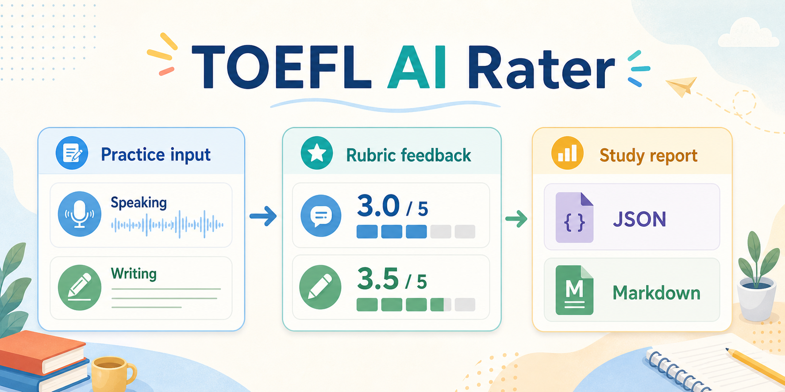

# TOEFL Speaking & Writing AI Rater / 托福 AI 口语写作评分



**TOEFL Speaking & Writing AI Rater** is a free, local-first workflow for TOEFL speaking and writing practice. It is also designed for Chinese learners searching for a practical **托福 AI 口语写作评分** tool, including local TOEFL speaking scoring (托福口语评分) and TOEFL writing feedback (托福写作评分).

The project turns a folder of practice prompts, transcripts, essays, and optional audio files into rubric-aligned scoring artifacts you can inspect, export, and improve over time.

Many TOEFL preparation products place useful scoring and feedback behind subscriptions, closed platforms, or opaque one-off chat sessions. This project takes a different approach: keep your practice data locally, bring your own OpenAI-compatible provider when you want model-based feedback, and generate structured reports that are easy to compare across sessions.

This is not an official ETS scorer and it does not claim verified high-stakes accuracy. The goal is practical and transparent: make TOEFL-style feedback easier to run, audit, and extend without locking your data inside a paid product.

## What You Get

- Local input discovery for `speaking_*` and `writing_*` practice files
- Reuse of existing transcripts, with optional API transcription for audio
- Heuristic local scoring for smoke tests and offline scaffolding
- OpenAI-compatible LLM scoring for richer rubric-aware feedback
- 11-task Speaking merge from 0-5 task diagnostics into a local 1-6 tracking band
- A reusable scoring workflow guide at `skills/toefl-ai-auditor/SKILL.md` for local TOEFL speaking audits
- JSON and Markdown reports for downstream tools and human review
- A residual scanner to help keep public repos free of private paths, handles, tokens, and old project leftovers

## Why It Is Useful

Typical TOEFL practice workflows become fragmented quickly: audio recordings in one folder, transcripts in another, essays in a notes app, and scoring guesses scattered across tutors or paid tools. TOEFL AI Rater gives that workflow a stable shape.

Run one command and get:

- a structured `report.json` for dashboards, notebooks, or progress tracking
- a readable `report.md` for quick review after each session
- consistent rubric dimensions across speaking and writing
- clear separation between transcription, scoring, reporting, and repo scanning

## Demo

- Demo walkthrough: [docs/demo.md](docs/demo.md)
- Architecture note: [docs/architecture.md](docs/architecture.md)
- Sample generated report: [examples/demo_output/report.md](examples/demo_output/report.md)
- Sample JSON output: [examples/demo_output/report.json](examples/demo_output/report.json)

### 拼写错题本

配套的 TOEFL 填词拼写错题本可直接在手机、平板或电脑上练习：
[`在线打开拼写错题本`](https://jiaronggabby.github.io/toefl-ai-rater/spelling-notebook/)。
它使用本地存储保存进度，并支持在“错题本”页面导出/导入学习进度。
答错后会先要求手动订正一次；订正再次写错时仍显示正确拼写和应填字母，然后把该词滚动到本轮队尾再测；独立答对后才移出队列并显示中文解释。
每次会从尚未掌握的历史错词中随机抽取；独立答对后移出当前队列，答错后的订正会滚动到队尾再测，需要时可从错题本恢复。

## Quick Start

### 1. Create an environment

```bash
python -m venv .venv
.venv\Scripts\activate
pip install -r requirements.txt
pip install -e .
```

On macOS or Linux, activate the environment with:

```bash
source .venv/bin/activate
```

### 2. Run the sample demo

```bash
python -m toefl_ai_rater run --project-root . --input-dir examples/sample_inputs --dry-run
```

The dry run uses the local heuristic scorer and does not force API calls.

### 3. Inspect the outputs

By default, the run writes:

```text
outputs/latest/report.json
outputs/latest/report.md
outputs/latest/residual_scan.json
```

### 4. Run the residual scan directly

```bash
python -m toefl_ai_rater scan --project-root .
```

## Input Naming Convention

The CLI is intentionally strict so it can work without hidden local state.

### Speaking

Use one shared item id per response:

```text
speaking_q1.wav
speaking_q1.prompt.txt
speaking_q1.transcript.txt
```

If you already have a transcript, save it as `speaking_q1.transcript.txt`. If you want API transcription, provide an audio file and configure the transcription provider.

### Writing

```text
writing_q1.prompt.txt
writing_q1.response.txt
```

## Provider Configuration

Copy `config.example.yaml` to your own config file if you want to change providers, models, base URLs, or output paths.

The project has two independent provider layers:

- `transcription`: `none` or `openai_compatible`
- `scoring`: `heuristic` or `openai_compatible`

Use environment variables for keys. Do not commit real tokens.

```powershell
$env:OPENAI_API_KEY="your-key-here"
```

Then point the CLI at your config:

```bash
python -m toefl_ai_rater run --project-root . --input-dir path/to/practice --config config.local.yaml
```

## Repository Layout

```text
toefl-ai-rater/
├─ config.example.yaml
├─ docs/
│  ├─ architecture.md
│  ├─ demo.md
│  └─ assets/
├─ examples/
│  ├─ sample_inputs/
│  └─ demo_output/
├─ scripts/
├─ src/
│  └─ toefl_ai_rater/
└─ requirements.txt
```

## Design Principles

- **Free and local-first:** Your practice files stay in your own folders.
- **Provider-neutral:** Use the built-in heuristic mode, OpenAI, or an OpenAI-compatible endpoint.
- **Rubric-aligned:** Outputs are organized around TOEFL-style dimensions instead of generic encouragement.
- **Inspectable:** Reports include per-dimension rationales, strengths, weaknesses, and revision plans.
- **Extensible:** Transcription and scoring are separate layers, so local ASR, dashboards, or custom scoring prompts can be added later.

## Current Limits

- Heuristic scoring is a fallback for demos and smoke tests, not a replacement for a strong rubric-aware model.
- Speaking delivery is inferred conservatively from transcripts unless you extend the audio analysis layer.
- The project has not been benchmarked against an official labeled TOEFL corpus.
- Input discovery expects the documented naming convention instead of guessing arbitrary folder layouts.

## Roadmap Ideas

- Local ASR backends such as Whisper.cpp or faster-whisper
- Speaking delivery features from duration, pause patterns, and speech rate
- Session-to-session progress tracking
- HTML report rendering with side-by-side drafts and revisions
- Optional benchmark scripts for tutor-rated or public sample sets

## License

MIT
