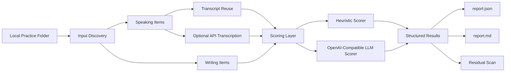

# Architecture

## Design choices

- Local-first input discovery: no hidden app state, no dependence on one TOEFL platform.
- Separate transcription and scoring providers: users with existing transcripts should not be forced through a speech API.
- Structured outputs first: JSON makes the workflow reusable for dashboards, notebooks, or future progress tracking.
- Residual scanning built into the workflow: useful when the repo may eventually be shared publicly.
- Conservative claims: the project is a transparent practice workflow, not an official TOEFL scorer or a validated high-stakes assessment engine.
